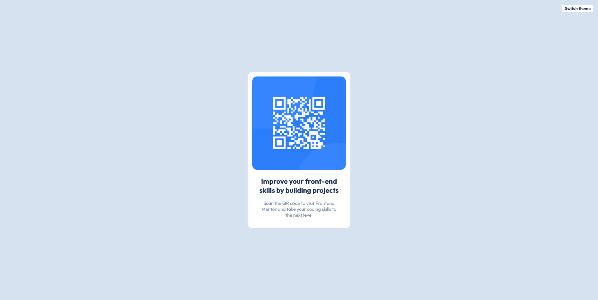
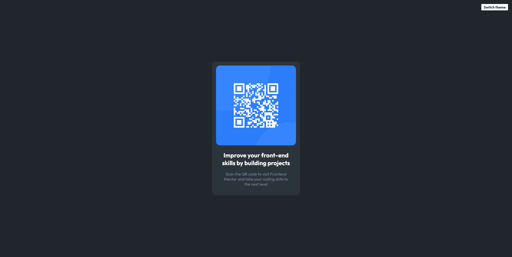
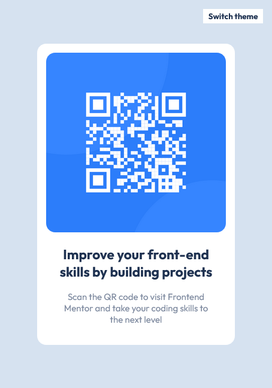
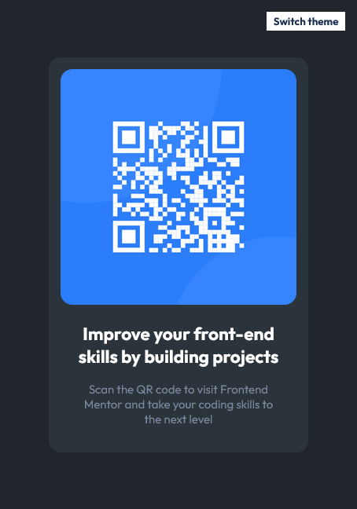

# Frontend Mentor - QR code component solution

This is a solution to the [QR code component challenge on Frontend Mentor](https://www.frontendmentor.io/challenges/qr-code-component-iux_sIO_H). Frontend Mentor challenges help you improve your coding skills by building realistic projects. 

## Table of contents
  
  - [Overview](#overview)
  - [Screenshot](#screenshot)
  - [Links](#links)
  - [Built with](#built-with)
  - [Author](#author)

### Overview

This is my first project on Frontend Mentor.
This is solution to the [QR code component challenge on Frontend Mentor](https://www.frontendmentor.io/challenges/qr-code-component-iux_sIO_H).

I added:
- dark theme using local storage and system preferences,
- qr code can be enlarged when clicked.

Any feedback is welcome! ❤

            
### Screenshot

### Links

- Solution URL: [Add solution URL here](https://your-solution-url.com)
- Live Site URL: [Add live site URL here](https://your-live-site-url.com)

### Built with

- Semantic HTML5 markup
- CSS custom properties
- Flexbox
- Mobile-first workflow
- BEM Methodology
- Java Script
- Local Storage

## Author

- Github - [Michał Czajkowski](https://github.com/cooodyyy)
- Frontend Mentor - [@cooodyyy](https://www.frontendmentor.io/profile/cooodyyy)

